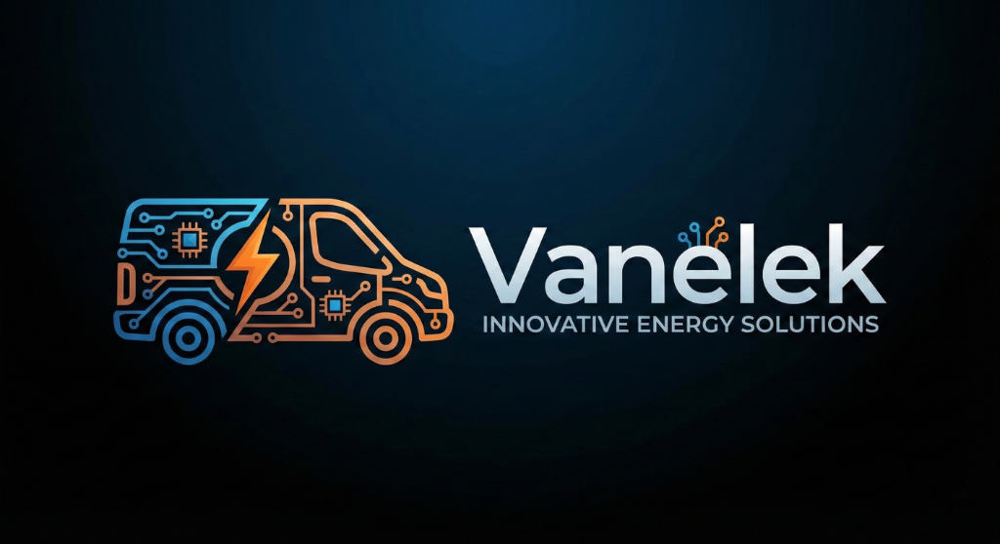

<div align="center">
  

  # Vanélek — Innovative Energy Solutions

  **Site vitrine du projet étudiant Vanélek**

  [](https://developer.mozilla.org/fr/docs/Web/HTML)
  [](https://developer.mozilla.org/fr/docs/Web/CSS)
  [](https://developer.mozilla.org/fr/docs/Web/JavaScript)
  [](LICENSE)

</div>

---

## 📋 Description

**Vanélek** est un projet étudiant ambitieux dédié à l'innovation énergétique. Ce dépôt contient le site vitrine officiel du projet, présentant la mission, les axes de développement et l'équipe.

Le site est conçu comme une **Single Page Application** (SPA) entièrement en HTML/CSS/JS vanilla — sans dépendance externe — avec un design dark mode premium aux couleurs bleues et orangées de la marque.

---

## ✨ Fonctionnalités

- 🌙 **Design dark mode** — charte graphique bleue nuit & orange
- 📱 **100% responsive** — optimisé mobile, tablette et desktop
- ⚡ **Zéro dépendance** — HTML, CSS et JavaScript vanilla pur
- 🎨 **Animations CSS** — fadeInUp en cascade, hover effects, micro-interactions
- ♿ **Accessible** — attributs ARIA, navigation clavier, landmarks sémantiques
- 🔍 **SEO-friendly** — meta tags, structure sémantique correcte
- 🍔 **Menu burger** — navigation mobile avec accessibilité complète
- 🇫🇷 **Conformité française** — Mentions légales, CGU, RGPD

---

## 🗂️ Structure du projet

```
web-site-vanelek/
├── index.html              # Page principale (HTML + CSS inline + JS)
├── logo.png                # Logo Vanélek (Innovative Energy Solutions)
├── mentions-legales.html   # Page mentions légales (lien dans le footer)
├── cgu.html                # Page CGU (lien dans le footer)
├── politique-confidentialite.html  # Page RGPD (lien dans le footer)
└── README.md               # Ce fichier
```

---

## 🗺️ Sections du site

| Section | Ancre | Description |
|---------|-------|-------------|
| **Accueil (Héro)** | `#accueil` | Logo, titre, slogan, boutons CTA |
| **Le Projet** | `#projet` | 4 axes : Innovation, Durabilité, R&D, Collaboration |
| **L'Équipe** | `#equipe` | Les 5 membres de l'équipe |
| **Contact** | `#contact` | Formulaire de contact / email |
| **Footer** | — | Liens légaux RGPD, CGU, Mentions légales |

---

## 🚀 Lancer le projet

Aucune installation requise. Il suffit d'ouvrir `index.html` dans un navigateur :

```bash
# Cloner le dépôt
git clone https://github.com/Skyllzz/web-site-vanelek.git
cd web-site-vanelek

# Ouvrir dans votre navigateur
start index.html          # Windows
open index.html           # macOS
xdg-open index.html       # Linux
```

Ou avec un serveur local (Live Server recommandé) :

```bash
# Avec Python
python -m http.server 8080

# Avec Node.js (npx)
npx serve .
```

---

## 🎨 Charte graphique

| Élément | Valeur CSS | Aperçu |
|---------|-----------|--------|
| Fond principal | `#05101f` | Bleu nuit très sombre |
| Fond secondaire | `#0a1e3a` | Bleu nuit |
| Accent bleu | `#3498db` | Bleu électrique |
| Accent orange | `#e67e22` | Orange vif |
| Texte principal | `#e8f4fc` | Blanc cassé |
| Texte secondaire | `#8bb8d4` | Bleu clair |

**Police** : Segoe UI / Roboto / Helvetica Neue (système)

---

## 👥 Équipe

| # | Prénom | Nom |
|---|--------|-----|
| 01 | Clément | Mandelli |
| 02 | Noé | Périllat |
| 03 | Sami | Rouabah |
| 04 | Emre | Tarakci |
| 05 | Paul | Rodo |

---

## 📄 Conformité légale

Ce site respecte les obligations légales françaises :

- **Mentions légales** — identité de l'éditeur, hébergeur
- **CGU** — Conditions Générales d'Utilisation
- **Politique de confidentialité** — conformité RGPD (Règlement Général sur la Protection des Données)

---

## 📜 Licence

Ce projet est sous licence **MIT** — voir le fichier [LICENSE](LICENSE) pour plus de détails.

---

<div align="center">
  <sub>© 2025 Vanélek — Projet étudiant · <em>Innovative Energy Solutions</em></sub>
</div>
